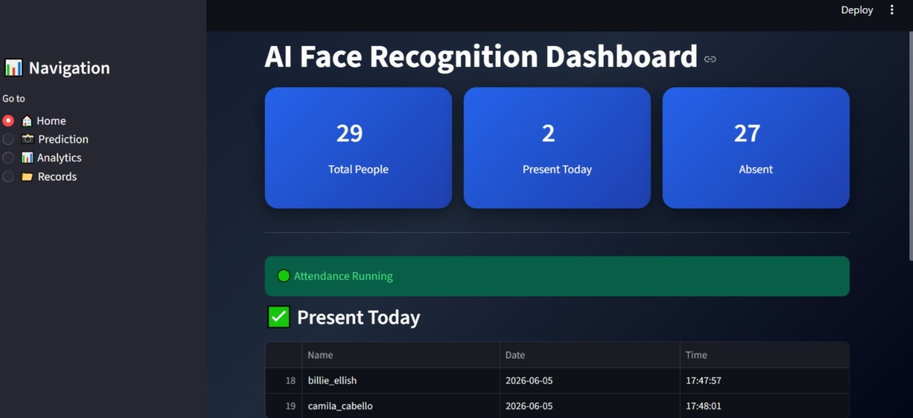
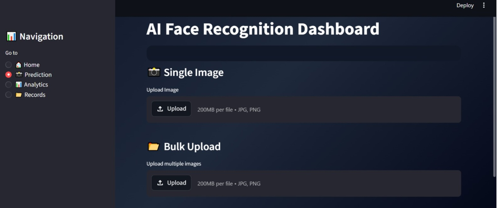
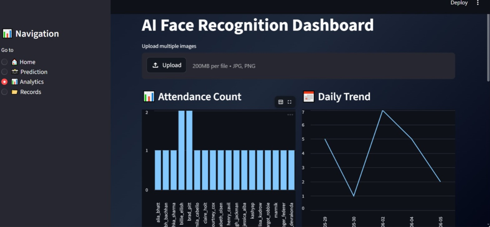
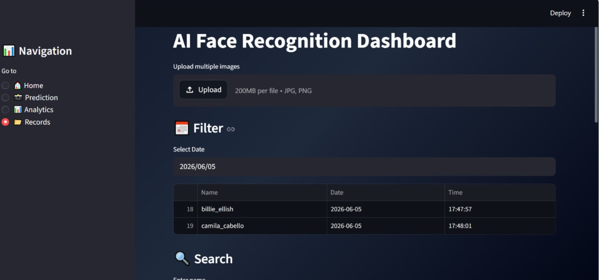
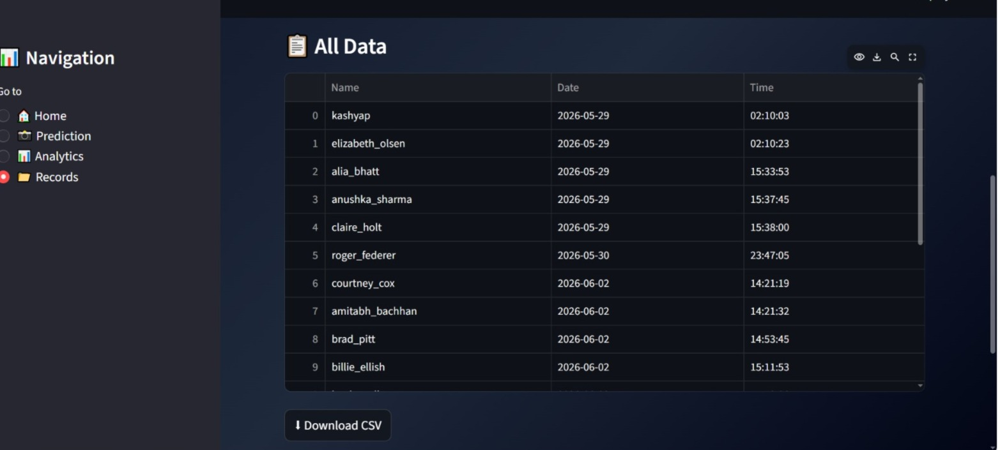

#  FACE-ATTENDANCE-RECOGNITION

##  Overview

This project is an AI-powered Face Recognition Attendance System that automates attendance marking using facial recognition.

---

## ✨ Features
- 📸 Single Image Face Recognition  
- 📂 Bulk Image Processing  
- 🧠 Face Embedding using DeepFace (FaceNet)  
- 📊 Real-time Dashboard using Streamlit  
- ✅ Automatic Attendance Marking  

---

## 🛠️ Technologies Used
- Python  
- Streamlit  
- DeepFace  
- TensorFlow / Keras  
- Pandas  

## 📸 Screenshots

### 🏠 Home Dashboard


### 📸Prediciton


### 📊 Analytics


### 📂 Records




## ▶️ How to Run
```bash
pip install -r requirements.txt
streamlit run dashboard.py